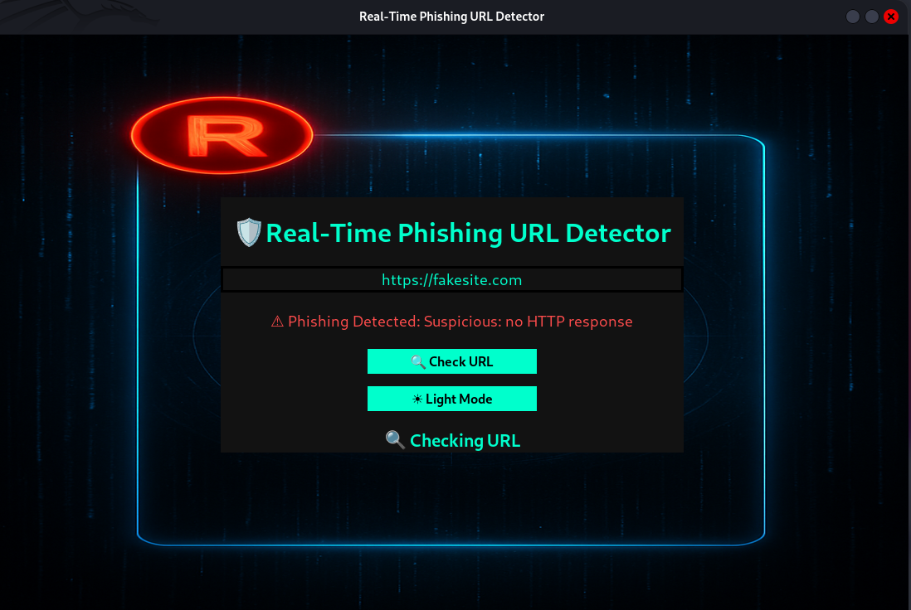
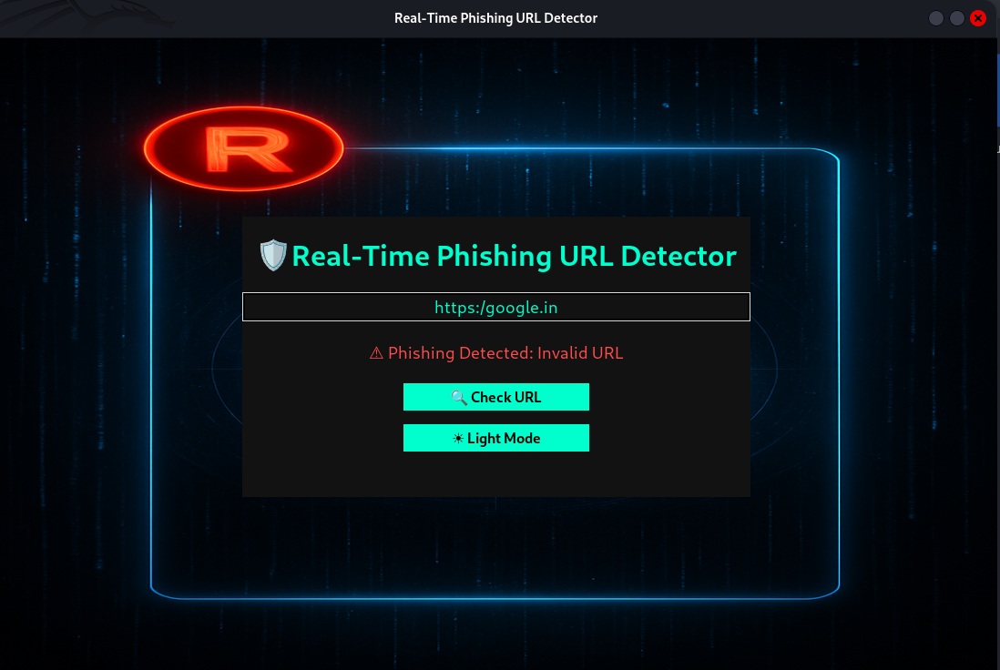
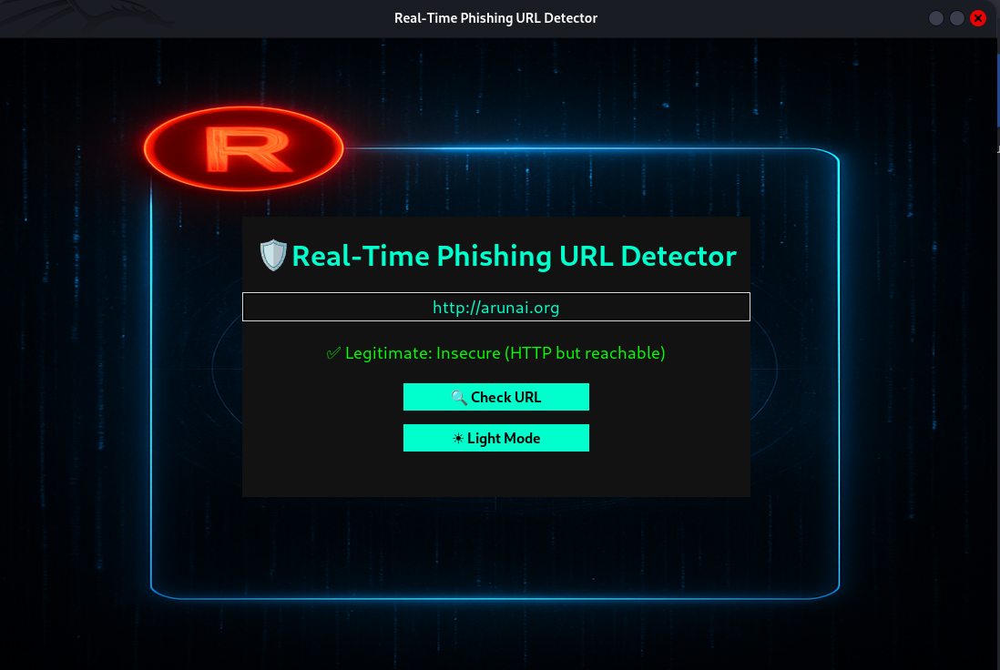

# 🔐 Phishing Website Detection Tool

A real-time phishing URL detection tool built in Python using a GUI interface. This tool helps users identify suspicious or malicious URLs to avoid phishing scams.

---

## 🎯 Objective

Detect phishing websites using rule-based logic such as:

- URL structure validation 
- DNS resolution check 
- HTTP/HTTPS status 
- SSL certificate validation 

---

## ✨ Features

- ✅ Real-time phishing detection
- 📡 DNS & protocol checks
- 🔒 SSL certificate validation
- 🌓 Dark/Light theme toggle
- 🎨 Stylish Tkinter-based GUI

---
## 📁 Folder Structure

| File/Folder            | Description                            |
|------------------------|----------------------------------------|
| `assets/`              | Folder containing background image     |
| └── `bg.png`           | Background image file used in GUI      |
| `phishing_gui_app.py`  | Main GUI application file              |
| `url_checker.py`       | URL analysis wrapper                   |
| `utils.py`             | Utility functions (validation, DNS, etc.) |
| `requirements.txt`     | Dependencies list for the project      |
| `README.md`            | Project documentation                  |
| `.gitignore`           | Git configuration to ignore files      |

---

## ⚙️ Setup Instructions

### 🔽 1. Clone the Repository

git clone https://github.com/Ragul0812/phishing-detector.git  
 | cd phishing-detector

---

### 🧪 2. Create a Virtual Environment (Optional but Recommended)

python3 -m venv venv | 
 source venv/bin/activate  |  # On Windows: venv\Scripts\activate

---

### 📦 3. Install Required Packages

pip install -r requirements.txt

---

### 🚀 4. Run the Application

python3 phishing_gui_app.py

---

## 🧰 Technologies Used

- **Python 3**
- **Tkinter** – GUI library
- **Regex, socket, ssl, http.client** – Backend logic
- **Pillow** – For image handling in GUI

---

## 📌 Requirements (from \`requirements.txt\`)

Pillow

> Add more if your project grows (e.g., scikit-learn for ML in the future).

## 📸 Project Output

Here are sample screenshots from the tool in action:

### 🖼️ Starting Page

### ✅ Legitimate URL (Secure)

### ⚠️ Illegitimate URL (Phishing)

### ❌ Invalid URL Format

### 🔓 Legitimate URL (Insecure)

This project is intended for educational use only.
Use responsibly and never to harm or deceive others.
